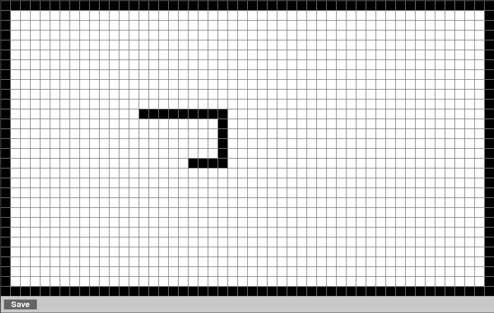
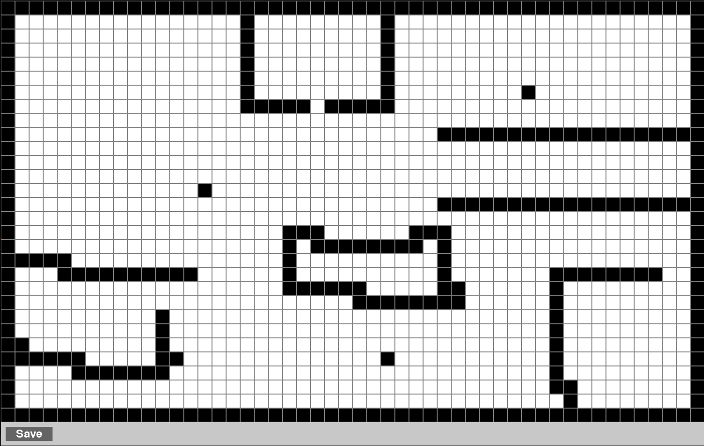

# Setup your environment
To set up your environment, follow the steps in the setup guide `Setup.md`.

# Creating a world
You must create a unique world to test your frontier exploration world. To do this, run the `create_world.py` file. This will open a pygame window where you can design your world by clicking to add obstacles. Once you're satisfied with your design, click the "Save World" button to save it to a text file. This file will be used as input for the frontier exploration algorithm.
Feel free to draw inspirations from Floor plans you are familiar with or might find intresting.
Any two persons with the same worlds would get penalized in the evaluation.
## Example




# Running the Frontier Exploration Algorithm
Once you have created and saved your world. You have to go to [Programming exercise](exercise.py) and implement the three functions: `detect_frontiers`, `calculate_frontier_centroids`, and `find_closest_frontier`.

After implementing these functions and written your algorithm, you can run the frontier exploration algorithm using the saved world file as input. This will allow you to test and evaluate your algorithm in the environment you designed.

```bash
python3 main.py --world path_to_your_saved_world.txt
python3 main.py --world world_20250922_125003.txt
```
